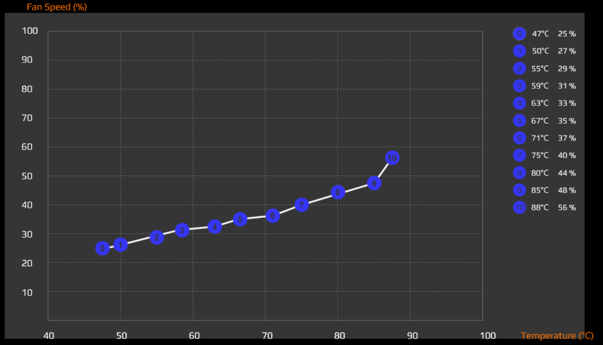
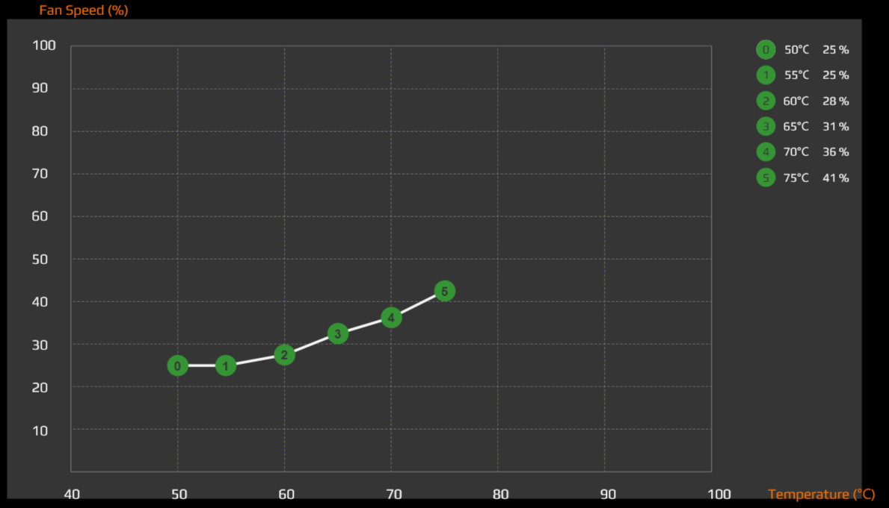
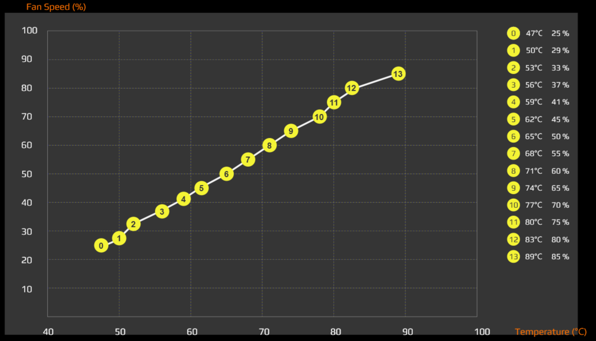
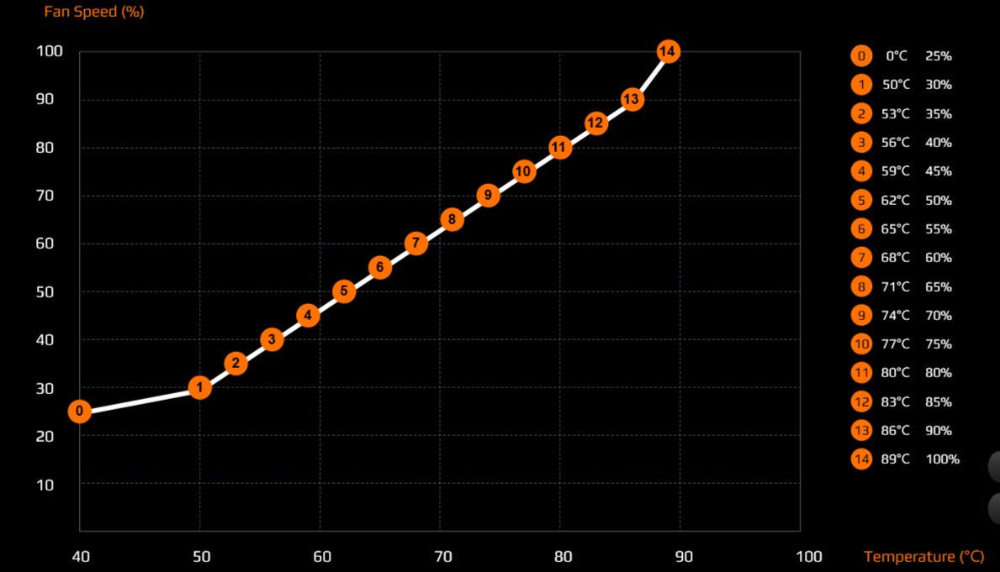

# Overview
This project provides a capability for fan control in the [(2020) Gigabyte AORUS 15G KB]() (Intel Core i7 10th Gen 10875H (2.30 GHz) and NVIDIA GeForce RTX 2060), it should apply to similar models.

The code of this script is based on:

1. The repo [p37-ec](https://github.com/jertel/p37-ec) written for who wrote a program for some older Gigabyte (specifically models P37Xv5 and P37Wv5).

2. Two forks of that repo, which were modified to with with Gigabyte [Aero 14](https://github.com/christiansteinert/p37-ec-aero-14) and [Aero 15](https://github.com/tangalbert919/p37-ec-aero-15).

This program reads/monitors and  writes/controls the embedded controller (EC) on the AORUS 15G to configure the different fan modes. Also enabling / disabling of the Touchpad and Screen is available for this laptop.

# Be careful
*This project comes without any warranty*
If you have a different laptop model than the one for which this program is intended then first double-check the correct EC register values by observing what the Windows fan control program is writing into the EC registers. Laptop EC registers can be monitored on Windows with the program [`RWEverything`](http://rweverything.com/).

**Writing values into the wrong registers may damage your laptop!**

# Instructions
First, ensure [`g++`](https://en.wikipedia.org/wiki/GNU_Compiler_Collection) is available on your distribution. Then compile via the following command:
`g++ p37-ec-aorus15g.c -o p37-ec-aorus15g`

To run and view current EC values (and enable the EC fan controller):
`./p37-ec-aorus15g`

Once the above command is executed you will see output similar to the following:
```
  Usage: sudo ./p37ec-aorus15g [<hex-offset[.bit]> <hex-value>|<bit-value>]
     Ex: sudo ./p37ec-aorus15g 0xB0 0xE5
     Ex: sudo ./p37ec-aorus15g 0x08.6 1

  -----------------------------------
  Current Embedded Controller Values:
    Touchpad and screen
      Touchpad (1 = Enabled)    [0x03.5]: 1
      Screen   (0 = Enabled)    [0x09.3]: 0
    Fan status
      Fan current mode:                   Normal mode
      Fan0 speed (%)            [0xB3]:   31%
      Fan1 speed (%)            [0xB4]:   31%
      Fan0 speed (RPM)          [0xFC]:   2875 RPM
      Fan1 speed (RPM)          [0xFE]:   2913 RPM
    Fan control
      Fan Quiet mode bit        [0x08.6]: 0
      Fan Gaming mode bit       [0x0C.4]: 0
      Fan Deep control mode bit [0x0D.7]: 0
      Fan Auto Max bit          [0x0D.0]: 0
      Fan Fix mode bit          [0x06.4]: 0
      Fan0 target speed (%)     [0xB0]:   84%
      Fan1 target speed (%)     [0xB1]:   84%
  -----------------------------------
```
The notation `[0xB0]` represents a **8-bit** register within the EC.  
The notation `[0x08.6]` means bit `6` (bit 0 is the LSB) of register `0x06`.  

# Fan modes
There are **six** fan modes available in the [AOURUS Control Center](https://download.gigabyte.com/FileList/Manual/ControlCenter_QSG_Manual_v1.1.pdf). Three are hard coded: **Normal**, **Quiet** and **Gaming**, and the other three can be configured: **AutoMax**, **Fix** and **Deep control**. More info about the fan modes in [this video](https://www.youtube.com/watch?v=PGDPZhM50KA). And all these modes seem to be controlled by different combinations of five single bits (`0x08.6`,`0x06.4`,`0x0D.0`,`0x0D.7` and `0x0C.4`), following the behaviour in this table:

| Fan mode \ `Bits` |`0x08.6`|`0x06.4`|`0x0D.0`|`0x0D.7`|`0x0C.4`|
| ---               |  ---   |  ---   |  ---   |  ---   |  ---   |
| **Normal**        |   0    |   0    |   0    |   0    |   0    |
| **Quiet**         |   1    |   X    |   X    |   X    |   X    |
| **Fix** \*        |   0    |   1    |   X    |   X    |   X    |
| **AutoMax** ^     |   0    |   0    |   1    |   X    |   X    |
| **Deep control**  |   0    |   0    |   0    |   1    |   X    |
| **Gaming**        |   0    |   0    |   0    |   0    |   1    |

\* For **Fix** mode, define the fan speed \%s in registers `0xB0` and `0xB1`  
^ For **AutoMax** mode, define the maximum fan speed \%s in registers `0xB0` and `0xB1`

## Normal mode
Mod by default, presents a balance of fan speeds, noise and performance.
<p align="center">
<br>
<B>Normal mode</B>: fan-speed vs temperature curve.
</p>

## Quiet mode
Fan speeds are reduced to minimize noise. Performance is lower as CPU and GPU are slower to minimize heating.
<p align="center">
<br>
<B>Quiet mode</B>: fan-speed vs temperature curve.
</p>

## Gaming mode
Similar to **Normal** mode, but places more importance to performance, leading to higher fan speeds and more noise. Use when the CPU and GPU are under intense workload.
<p align="center">
<br>
<B>Gaming mode</B>: fan-speed vs temperature curve.
</p>

## AutoMax mode
User sets the **maximum** fan speeds in registers `0xB0` and `0xB1` (for left and right fan respectively). Then the CPU and GPU speeds are controlled to avoid setting the fan speeds higher than the user set speed. Fan speed values are set such that `100\%` is equal to `229`(decimal) or `E5`(hexadecimal).  

## Fix mode
User sets the **desired** fan speeds in registers `0xB0` and `0xB1` (for left and right fan respectively). Then the CPU and GPU speeds are controlled to avoid setting the fan speeds higher than the user set speed. Fan speed values are set such that `100\%` is equal to `229`(decimal) or `E5`(hexadecimal).  

## Deep control mode
User manually draws the fan-speed vs temperature curve in the [AOURUS Control Center](https://download.gigabyte.com/FileList/Manual/ControlCenter_QSG_Manual_v1.1.pdf) to set the desired fan speeds in relation to different temperatures.
<p align="center">
<br>
<B>Deep control mode</B>: (Default) fan-speed vs temperature curve.
</p>

# Required Kernel Module
You need to be able to load module `ec_sys` into your Linux kernel.
The module will be loaded automatically by the program so you don't need to
load it yourself. But if you are having problems even though you run the
program as root then the reason might be that your Linux kernel was not compiled
with the `ec_sys` module. You can check whether the module is available on your system
by executing `sudo modprobe ec_sys`

# Support for other features for AORUS laptops
In addition, the support for the +/- brightness function keys can be fixed with:  
https://github.com/blmhemu/opengigabyte

Moreover, the control of the keyboard RGB LEDs can be performed with:  
https://github.com/rcassani/keyboard-fusion-rgb

# Disclaimer
*This project is not affiliated with GIGA-BYTE Technology Co. Ltd.*
